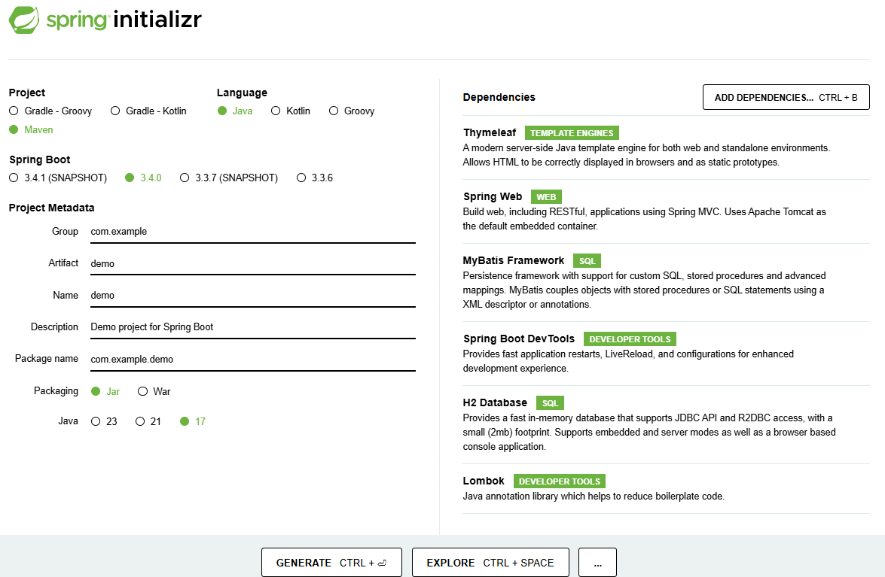

# spring-boot3-try

Spring-Bootで効率的なアプリケーション開発

## やりたいこと

* Spring-Bootを使った効率的な開発を行い、最低限必要な手順でアプリケーションを起動する
* JAVAだけがインストールされたマシンで、アプリケーションを起動する
* 起動時に自動でテーブルをcreateし、データをinsertしてから、アプリケーションが起動する
* ORマッパーは`MyBatis`を使う
* setter,getterは実装せず、`lombok`で生成する
* データ登録画面では、二重サブミット対策としてPRGパターンを使う
* アプリケーション開発は、`Spring Initializr`からデモアプリケーションをダウンロードして始める
* `Maven`を使ったライブラリ管理（自動でjarをダウンロードして、クラスパスを通してくれる）
* `spring-boot-devtools`で、アプリ起動中にソースコードを修正して保存するだけで、自動的にビルドと再起動が行われ、アプリケーションに即時反映される

> [!TIP]
> さいきょうの二重サブミット対策  
> https://qiita.com/syobochim/items/120109315f671918f28d  
> 
> 【Java】Lombokで冗長コードを削減しよう  
> https://www.casleyconsulting.co.jp/blog/engineer/107/ 

## Spring-Bootとは

- 設定ファイルレス  
  Spring-WEB-MVCに対して、あらかじめ様々な設定が設定済みとなっているため、自分で設定ファイルを書く量が少ない

- 簡単起動  
  組み込みTomcatを使用するため、Tomcatのインストールが不要

- 素早く開始  
  `Spring Initializr`を使って必要なライブラリが組み込まれた初期構成のアプリケーションをダウンロードできる

- 短所としては、ライフサイクルが比較的短い  
  https://spring.pleiades.io/projects/spring-boot#support

## 前提環境

以下がインストール済みであること
* JDK 21
  * `JAVA_HOME`を環境変数に設定すること
* GitBash

> [!TIP]
> Java環境構築(Windows版)　JDKインストール  
> https://www.techfun.co.jp/services/magazine/java/windows-jdk-install.html  
> 
> Java環境構築(Windows版)　パスの設定  
> https://www.techfun.co.jp/services/magazine/java/windows-jdk-pathset.html  
> 
> Git Bashって使ってる？Windowsで動く意外にすごい便利ツール  
> https://www.sejuku.net/blog/72673  

## 使用するフレームワーク

* spring-boot3.4
* spring-boot-starter-web
* spring-boot-devtools
* thymeleaf
* mybatis
* lombok
* 組み込みh2データベース
* 組み込みTomcat 10
* 組み込みMaven 3

## ディレクトリ階層

今回、起動するアプリケーションのディレクトリ階層
```
C:.
│  .gitignore
│  mvnw
│  mvnw.cmd
│  pom.xml
│  README.md
├─.mvn
│  └─wrapper
│          maven-wrapper.jar
│          maven-wrapper.properties
└─src
    ├─main
    │  ├─java
    │  │  └─com
    │  │      └─example
    │  │          └─demo
    │  │              │  DemoApplication.java
    │  │              ├─entity
    │  │              │      Item.java
    │  │              │      ItemMapper.java
    │  │              └─web
    │  │                  ├─master
    │  │                  │  └─item
    │  │                  │          ItemForm.java
    │  │                  │          ItemRegistService.java
    │  │                  │          RegistController.java
    │  │                  └─menu
    │  │                          ItemFindService.java
    │  │                          MenuController.java
    │  └─resources
    │      │  application.properties
    │      │  data-all.sql
    │      │  schema-all.sql
    │      ├─static
    │      └─templates
    │          │  menu.html
    │          └─master
    │              └─item
    │                      complete.html
    │                      confirm.html
    │                      index.html
```

## アプリケーションの構造


* Formクラスは画面層で使用するクラス。データベース層ではFormクラスの使用は禁止。しっかりレイヤーを分ける。
* Entityクラスはデータベース層で使用するクラス
* 画面層ではEntityクラスは使用しないが、表示用には使用しても良い。Formという役割でEntityを使うことはダメ。
* コントローラ⇒サービス⇒マッパーのレイヤーを守って実装する。
* コントローラ⇒マッパーというようなメソッド呼び出しは禁止。しっかりレイヤーを守る。

## 準備 githubからソースコードを取得

gitを使ってソースコードをダウンロードする
```
コマンドプロンプトで実行
git clone https://github.com/namickey/spring-boot3-try.git
cd spring-boot3-try
```

> [!TIP]
> ハンズオンで学ぶGit  
> https://qiita.com/kanekanekaneko/items/c55bf4fc74babf23bbfa  
> 
> 【Windowsでgitを使おう！】導入方法とはじめにすべき設定まとめ | 侍エンジニアブログ (sejuku.net)  
> https://www.sejuku.net/blog/77097  
> 
> GitやGitHubでSSHに接続する方法をわかりやすく解説！ | 侍エンジニアブログ (sejuku.net)  
> https://www.sejuku.net/blog/74220  

## 実行 spring-boot:run

起動する
```
コマンドプロンプトで実行
mvnw.cmd spring-boot:run

「mvn」や「mvnw.cmd」はmavenのコマンドで、pom.xmlに記載されたライブラリ管理（自動的にクラスパス追加）
初回はライブラリのダウンロードに多少時間がかかった後に、起動する
```

## ブラウザアクセス
http://localhost:8080/

機能一覧
* メニュー画面でitem一覧を表示する  
* 登録画面でitemを登録する  

## 停止
```
起動中のコマンドプロンプトで、以下を実行
Ctrl + C
```

## やってみよう 1
この実装と完全に同じ実装をしてみよう。  

1. `Spring Initializr`から初期構成のアプリケーションをダウンロードする  
https://start.spring.io/  


2. 統合開発環境を使って、今動かしたソースコードと同じものを実装し、動作確認する
> [!TIP]
> 統合開発環境（vscode、eclipse、intelliJ）を使おう  
>   * vscode：おススメ、最新、軽量  
>   * eclipse：古き重き友人  
>   * intelliJ：おススメだが、`spring-boot-devtools`の自動デプロイ機能と相性が悪い。intelliJは入力する度にファイル保存されてしまうから。  

## やってみよう 2
この実装と異なる実装をしてみよう。  
例えば、「item」という名称を別の名称「???」に全て変えて実装してみよう。  
画面項目やDB項目の型や数は、同じにして、「item」という名称だけを変更する。  

## やってみよう 3
この実装と異なる実装をしてみよう。  
例えば、item管理ではなくて、タスク登録画面を作ってみよう。  
画面項目やDB項目の型や数を変える。画面のボタンの数も変えるなど。  

## やってみよう 4

1. 自分のgithubアカウントを作って、作ったソースを公開しよう

## やってみよう 5

1. githubでgitフローを使って開発しよう
> [!TIP]
> ## 必ず使う`Gitフロー`を覚えよう
> 
> 【図解】git-flow、GitHub Flowを開発現場で使い始めるためにこれだけは覚えておこう  
> https://atmarkit.itmedia.co.jp/ait/articles/1708/01/news015.html  
> 
> Git-flow ～Gitのブランチモデルを知る～  
> https://tracpath.com/bootcamp/learning_git_git_flow.html  

## 参考

> [!NOTE]
> ## 要件定義に関する良記事
> 
> 要件定義・プロジェクト企画に必要なネゴシエーションをロジカルに学ぶ記事  
> https://qiita.com/Saku731/items/c43137a6f4bf7166490a  
> 
> 要件定義～システム設計ができる人材になれる記事  
> https://qiita.com/Saku731/items/741fcf0f40dd989ee4f8  

> [!NOTE]
> ## 必ず使う`Maven`を覚えよう
> 
> Mavenとは何ぞや  
> https://qiita.com/ASHITSUBO/items/6c2aa8dd55043781c6b4  
> 
> Mavenキホンのキ  
> https://tech-lab.sios.jp/archives/25867  
> 
> Mavenの基本勉強メモ  
> https://qiita.com/opengl-8080/items/bb32732f9aa5cb3495d2  

> [!NOTE]
> ## SpringBootバージョンアップ2系⇒3系
> 
> Spring Boot 3の新機能を使ってみよう！ 2からアップグレードする手順、Observability機能、ネイティブイメージ化  
> https://eh-career.com/engineerhub/entry/2023/06/29/093000  
> 
> Spring Boot 2.7.x から 3.0.x へのアップデート  
> https://zenn.dev/red_frasco/articles/637280c126d959  
> 
> Spring Boot 3.0へのバージョンアップで発生した問題点と対応内容  
> https://techblog.zozo.com/entry/springboot-version-up-to-3  
> 
> Spring Boot 3.0 (Spring Framework6.0) へのアップデートで対応したこと  
> https://qiita.com/kazokmr/items/ae0b70cfbc06ec344c44  
> 
> Spring Boot 3.0へのアップデートのハマり所  
> https://speakerdeck.com/line_developers/findings-in-migrating-our-application-to-spring-boot-3-dot-0  
> 
> SpringBoot 2.7 to 3.0 アップデートまとめ  
> https://hirabay.net/?p=61  
